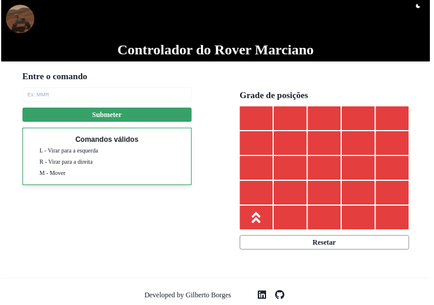
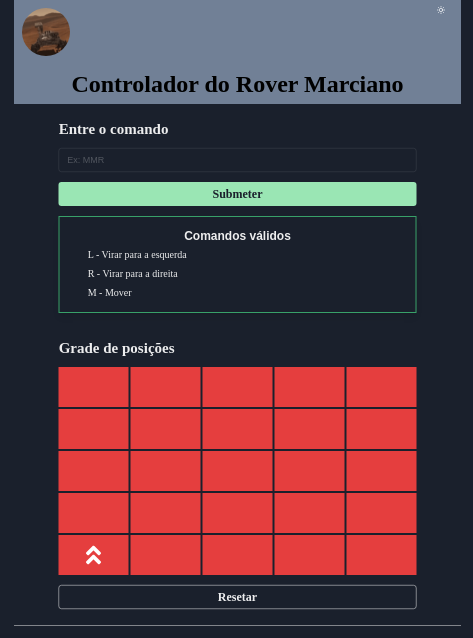

# :rocket: Desafio - Robô NASA

Olá, este projeto foi proposto pela [UME](https://www.portal.ume.com.br/) como parte do processo seletivo para o cargo de desenvolvedor. 
Clicando [aqui](https://ume-challenge-robot-controller.vercel.app/) você poderá conferir a página web do projeto :slightly_smiling_face:. 
Neste README apresentarei uma visão geral do problema e do projeto desenvolvido.

---

# Visão geral do problema

Um time de robôs devem ser colocados pela NASA para explorar um terreno em Marte.
Esse terreno, que é retangular, precisa ser navegado pelos robôs de tal forma que suas
câmeras acopladas possam obter uma visão completa da região, enviando essas imagens
novamente para a Terra.

A posição de cada robô é representada pela combinação de coordenadas cartesianas (x, y) e
por uma letra, que pode representar uma das quatro orientações: NORTH, SOUTH, EAST e
WEST. Para simplificar a navegação, a região “marciana” a ser explorada foi subdividia em
sub-regiões retangulares.

Uma posição válida de um robô, seria (0, 0, N), que significa que o robô está posicionado no
canto esquerdo inferior do terreno, voltado para o Norte.
Para controlar cada robô, a NASA envia uma string simples, que pode conter as letras ‘L’, ‘R’ e
‘M’. As letras ‘L’ e ‘R’ fazem o robô rotacionar em seu próprio eixo 90 graus para esquerda ou
para direita, respectivamente, sem se mover da sua posição atual. A letra ‘M’ faz o robô
deslocar-se uma posição para frente.

Assuma que um robô se movimenta para o NORTE em relação ao eixo y. Ou seja, um passo
para o NORTE da posição (x, y), é a posição (x, y+1)

### Exemplo:

Se o robô está na posição (0,0,N), o comando "MML" fará ele chegar na posição (0,2,W)

## O Desafio

Escreva um programa que permita aos engenheiros da NASA enviar comandos para o Robô e
saber onde ele se encontra. Os engenheiros irão rodar testes no seu software para garantir que
ele se comporta da forma esperada, antes de enviar o Robô para marte.

## Requisitos básicos

- O terreno deverá ser iniciado com 5x5 posições;
- O robô inicia na coordenada (0,0,N);
- Deverá ser possível enviar um comando para o Robô que me retorne a posição final dele;
- O Robô não pode se movimentar para fora da área especificada;

---

# :toolbox: Ferramentas utilizadas no projeto

Este é um projeto React construído utilizando o _framework_ [Next.js](https://nextjs.org/), pois o mesmo nos oferece algumas vantagens no desenvolvimeto de projetos React, como por exemplo _SSR_, gerenciamento de rotas, fácil integração com API Rest, e etc. Você pode consultar com detalhes essas e outras vantegens [neste link](https://www.alura.com.br/artigos/next-js-vantagens).
Como ambiente de execução Javascript server-side foi utilizado o [Node.js](https://nodejs.org/pt-br/about/), o qual nos permitirá pré-visualizar o estado de nossa aplicação durante o desenvolvimento, sendo um requisito para executar o Next.js.

Além disso foi utilizada a biblioteca de componentes React [Chakra UI](https://chakra-ui.com/), devido à facilidade fornecida para a estilização de componentes por meio das _props_ de estilo dos componentes, sem a necessidade de criação de uma folha de estilos CSS para nossa aplicação.

# :arrow_forward: Rodando o projeto localmente.

### Pré-requisitos para rodar esse projeto.

Para exucutar este projeto em seu ambiente local, o seu sistema deverá ter os seguintes requisitos:

- Node.js 12.22.0 ou versão superior. Caso não tenha o Node.js instalado em sua máquina [clique aqui](https://nodejs.org/ pt-br/download/) para as instruções de como instalá-lo.
- [Clonar](https://docs.github.com/pt/repositories/creating-and-managing-repositories/cloning-a-repository) esse respositório do GitHub no lugar de sua preferência em seu ambiente local.
  Para rodar este projeto localmente após [clonar] este repositório do GitHub, basta inicializar o repositório
- Opcialmente você poderá instalar o gerenciador de pacotes Yarn, um gerenciador de pacotes JavaScript que permite uma maneira rápida e segura de inicializar de pacotes.
  Para instalar o yarn globalmente você pode inserir o seguinte comando no terminal bash:

  ```bash
  npm install -g yarn
  ```

  ou se preferir instalá-lo apensa localmente, navega pelo terminal até o repoitório colocado e digite o comando acima sem a _flag_ `-g`.

# :gear: Executando o projeto localmente

Primeiramente abra o terminal no diretório raiz do repositório clonado (ou navegue até ele) e digite o seguinte comando (dependendo se você está utilizando npm ou yarn!)

```bash
npm run dev
# ou
yarn dev
```

Abra o seu navegador em [http://localhost:3000](http://localhost:3000), ou <kbd>Ctrl</kbd> + <kbd>Click - LMB</kbd> sobre o link que aparecerá no _log_ do terminal.

---

# :information_source: Sobre o projeto.

Este projeto na versão atual consiste em uma aplicação _React_, sem integração com uma API, sendo desenvolvida portanto apenas um fornt-end interativo para esta aplicação.

 ## Visão Geral sobre o Fornt-End

  A imagem abaixo mostra a página principal da aplicação. A mesma contém uma _navbar_ com um botão no canto superior direito que permite alternar entre tema _dark_ e _light_ (try it :grinning:!). O conteúdo da página foi dividido em um _grid_, com duas colunas para dispositivos com tela de largura `> = 992px`.
  

  Para dispositivos com tela de larura `< 992px` o _grid_ terá apenas uma coluna, como mostra a imagem abaixo. Esta responsividade foi tratada utilizando os valores padrão dos _breakpoints_ fornecidos pela biblioteca Chakra UI, e passados ao _grid_ com as props de estilo do Chakra. A imagem abaixo também mostra a visualização da página em _dark theme_.

  

## Estratégia de implementação adotada

A execução deste projeto foi divida em três etapas principais:

1. A estruturação dos elementos básicos do Front-End, criando um front estático;
2. A implementação da lógica de renderização condicional dos componentes do Front-end;
3. A implementação da lógica de negócios da aplicação (avaliação do comando inserido)

## Estrutura do projeto.

A fim de obter maior organização do código alguns componentes foram criados em `packages/components`, na sequência serão fornecidos mais detalhes sobre alguns destes componentes.
Por se tratar de um projeto Next.js o arquivo `.js` que renderizará a página principal é o `/pages/index.js`, no corpo deste arquivo será chamado o componente `<App/>`, o qual será o componente pai de todos os outros componentes criados (_higher-order component_). No arquivo `index.js` também foi declarada uma variável global `SQUARES_MATRIX` que é um _array_ de objetos e será passado como `props` ao componente `<App/>`. Cada um dos objetos em `SQUARES_MATRIX` contem as informações de sobre o correspondente quadrado do grid.

A lógica de calculo do estado final do robô é implementada pelo componente `useLogic` (definido em `useLogic.js`), o qual é um _hook_ personalizado, que é importado pelo componente `<App\>`. Desta maneira é possível separar a lógica de negócios do Fornt-End.

## Principais Componentes.

Aqui será dada uma visão geral sobre alguns os pricinpais componentes desta aplicação, estes constituem uma base para o funcionamento da aplicação.

### Component Rover.js

Este componente representa o nosso robô, e recebe uma única `props` (`props.direction`) que será utilizada para determinar em qual direção ele estará apontando após um comando ser executado, desta forma ele possui uma lógica interna de renderização. Seu retorno é simplesmente um componente um ícone dentro de um componete [Box](https://chakra-ui.com/docs/layout/box) do Chakra UI.

### Componete Square.js

Este componente representa uma posição do _grid_ que representa o terreno explorado pelo _rover_. As suas propriedades estão ligadas ao objeto `squareObjects` criado pela função `createSquaresMatrix` e salvas no array `SQUARES_MATRIX`. Quando sua `props.isOcuppied = true` este componente renderiza o componente `<Rover/>`dentro dele, passando `props.direction` para o mesmo. Quando o (a) usuário(a) interage com esse elemento colocando sobre ele o cursor do mouse, as informações sobre suas coordenadas `(x, y)` são mostradas em um _tooltip_.

### Compunete InputField.js

Este componente representa o formulário com um `input` do tipo texto e um botão para submeter o comando dado pelo(a) usuário(a). Tem uma _callback_ props (`calculateCommand(command)`) que receberá do componente pai uma função a ser executada quando o comando dado pelo usuário for submetido.

### Componente App.js

Este comoponente, como dito anteriormente, será o componente pai de todos os outros elementos. Ele recebe de `index.js` como `props` uma lista representando cada quadrado do grid e a passa como parâmetro ao _hook_ `useLogic()`. Também importa de `useLogic()` funções e estados para serem repassados a seus componentes filhos como `props`.

## Lógica do cáclculo de posição.

Uma parte importante para a lógica implementada no cálculo da posição e orientação final do robô foi a estruturação dos dados em `SQUARES_MATRIX` passados ao componente `<App/>`. Os objetos nesta lista possuem as seguintes propriedades (chaves) que serão utilizadas:

- `coordinates`: que representa as coordenadas (x, y) do quadrado
- `id`: que gera um idenficador único para ser utilizado pos Squares como `props.key` na renderização iterativa, que é uma propriedade necessário neste tipo de renderização em React
- `index`: que relaciona as coordenadas (x, y) com o index deste objeto no _array_ em que é armazenado. Esta relação se dá pela equação: `index = 5 * (4 - y) + x`
- `neighborsIndex`: que é um objeto indica o index dos quadrados vizinhos em cada direção (N, W, S, E), quando esses vizinhos não existem em uma dada direção esse valor recebe uma _string_ vazia.
- `occupied`: que recebe um valor _booleano_ indicado se este quadrado está ocupado ou não.

A lógica para determinar a posição e orientação final do robô é implementada em `useLogic.js` da seguinte maneira:

1.  Após validar a sintaxe do comando enviado, a função `calculateCommand` percorre o array de estado `squares` e identifica o objeto que possui a prorpiedade `occupied = true`, passando este objeto e o comando enviado (`command`) para a função `determineFinalSquare`.
2.  A função `determineFinalSquare` toma o estado inicial de direção do _robô_ (roverDirection) como inicialização da orientação (`moveDirecion`) e usa o objeto representando a posição inicial passada para ela (`initialSquare`) para inicializar a poisção atual do robô (`currentSquare`). Após isso itera sobre a _string_ recebida analisando o tipo de comando:
    - Se for um comando de movimentação (`M`) ela busca na propriedade `neighborsIndex` de `currentSquare` qual o index do quadrado vizinho na direção em que o rover aponta. Caso esse index seja `" "` então esse quadrado está fora da área do grid e a função retorna um objeto vazio. Por outro lado, caso o index exista `currentSquare` recebe o objeto no _array_ de estado `squares` de posição igual ao index encontrado.
    - Se for um comando de rotação (`L` ou `R`) a função `calculateRotation` é chamada recebendo a direção atual do rover e o camando de rotação. Em posse desses parâmetros `calculateRotation` primeiro transfomra a string de posição em um número usando o dicionário `directionToNumber` e soma 1 a este número no caso de uma rotação no sentido positivo (`L`) ou subtrai 1 para rotação no sentido negativo (`R`). Caso o número obtido seja `> = 4` subtraimos 4 do valor obtido e caso esse valor seja `< = 4` soma-se 4, explorando desta forma a propriedade `mod 4`destes valores, onde 4 é equivalente a 0, -1 equivalente a 3 e etc. Por fim o número obtido é convertido na _string_ que representa a direção após aquela rotação, através do dicionário numberToDirection.
      Ao final a função `determineFinalSquare` retorna o objeto que representa o quadrado que será ocupado pelo robô.
3.  A função `calculateCommand` armazena o retorno de `determineFinalSquare` e analisa se o objeto retornado é vazio (comprimento do _array_ de chaves é 0) caso seja ela chama `setPositionErr()` que gerencia o estado de erro de posição e passa para ela o valor true retornando em seguida. Caso a posição retornada seja válida ela chama `setFinalSquare` que gera um novo _array_ de objetos, desocupando aquele ocupado previamente e ocupando aquele que representa a posição final e passa esse novo _array_ para `setSquares` que gerencia o _hook_ de estado `squares`.
4.  Por fim, caso o comando contenha instruções de rotação a função que gerencia o _hook_ de estado `roverDiretion` é chamada passando para ela uma callback que analisa apenas os comandos de rotação e atualiza a orientação final do robô.

# Melhorias e desdobramentos futuros:

Algumas melhorias podem ser realziadas neste projeto, dentre elas pode-se destacar:

- A construção de um Back-End constituído de uma API rest para realizar a lógica do cálculo de posições, bem como a integração desta com a aplicação.
- A criação de uma página com instruções de uso aos usuários, cujo gerenciamento de rota pode ser facilmente realizado devido o uso do Next.js.
